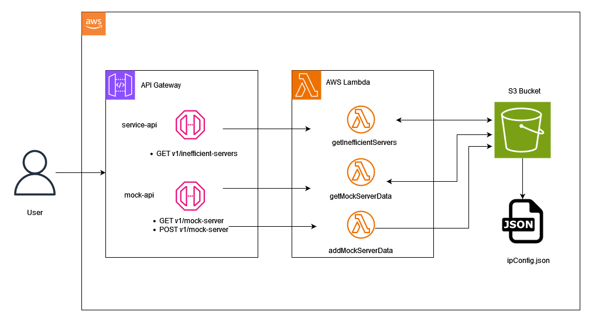
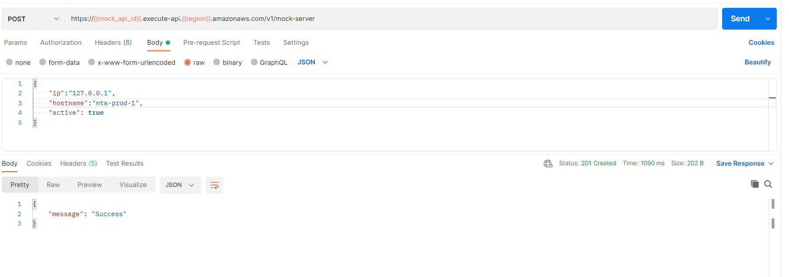

# MTA-hosting-optimizer

## Description

MTA-hosting-optimizer is a service that uncovers the inefficient servers hosting only few active MTAs(Mail Transfer Agents)

## Architecture


## Getting Started

### Dependencies

- AWS account
- AWS CLI
- Golang 
- Windows OS

### Clone the reposiory
```
git clone https://github.com/shobhit977/mta-hosting-optimizer.git
```
### Deploy the AWS resources

There are multiple ways to deploy AWS resources . In this we'll cover the 2 basic methods :
1. Via AWS console.
2. Via AWS cli

Resources :
- Lambda function:
    - Build all 3 Go programs 
        ```
        GOOS=linux go build -o bin/main
        ```
    - Create a ZIP of the build files and upload to AWS via console.
        
        OR

    - Deploy via aws cli
        ```
        aws lambda create-function --function-name my-function \
        --zip-file fileb://main.zip --handler main --runtime go1.x \
        --role arn:aws:iam::123456789012:role/lambda-ex
        --environment '{"Variables":{"threshold":"threshold_value"}}'
        ```
    - Note :
        - If deploying via console add environment variable in getInfficientServers lambda configuration
        - 

- API Gateway:
    - Create HTTP API via AWS console
    - Create routes for the API
    - Attach the lambda integration to the route
    
    
    - Add permission for the API to invoke the lambda function
    - Dont forget to deploy the API after creation.

- s3 Bucket :
    - Create the S3 bucket via AWS console 
    - Provide the bucket name and region(Bucket name must be unique. Change the bucket name in `const.go` as per the input)
    - Provide the lambda function necessary permission to read , write and list data in s3bucket.

    OR

    - Create bucket via aws cli
        ```
        aws s3api create-bucket --bucket {bucketName} --region {regionName}
        ```
 
### Executing the APIs

To Execute service API to get inefficient servers :
- Execute via postman :
    - Method : **GET**
    - API : https:/{{service_api_id}}.execute-api.{{region}}.amazonaws.com/v1/inefficient-servers
    - 

    - `service_api_id` : 76droe54z3
    - `region` : api-south-1

To Execute mock API to add server data :
- Execute via postman :
    - Method : **POST**
    - API : https:/{{mock_api_id}}.execute-api.{{region}}.amazonaws.com/v1/mock-server
    - Body :
        ```json
        "ip":"127.0.0.5",
        "hostname":"mta-prod-5",
        "active": true
        ```
    - 
    - `mock_api_id` : z4hz2a61j9
    - `region` : api-south-1
    
To Execute mock API to get server data :
- Execute via postman :
    - Method : **GET**
    - API : https:/{{mock_api_id}}.execute-api.{{region}}.amazonaws.com/v1/mock-server
    - 

## Authors

Contributors names and contact info

- Name : Shobhit Gupta
- Email : shobhit00gupta@gmail.com